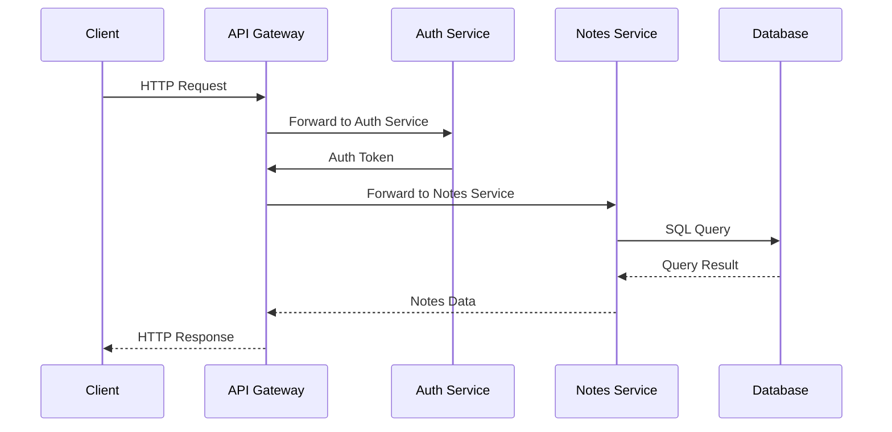
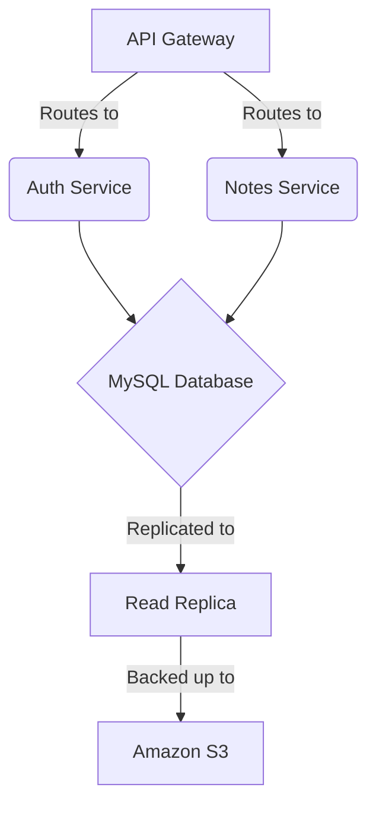

# Notes App 📝

A production-ready notes application with MySQL backend, complete CI/CD pipeline, Docker support, and automated releases.

## 🚀 Quick Start

### Docker (Recommended)

```bash
# Pull the latest image
docker pull yourusername/notes-app:latest

# Run with Docker Compose
docker-compose up -d

# Or run standalone
docker run -d \
  -p 3000:3000 \
  -e DB_HOST=your-db-host \
  -e DB_USER=your-db-user \
  -e DB_PASSWORD=your-db-password \
  -e DB_NAME=notes_app \
  yourusername/notes-app:latest
```

### Local Development

```bash
# Install dependencies
npm install

# Start MySQL
docker run -d -p 3306:3306 \
  -e MYSQL_ROOT_PASSWORD=password \
  -e MYSQL_DATABASE=notes_app \
  mysql:8.0

# Configure environment
cp .env.example .env
# Edit .env with your database credentials

# Run development server
npm run dev

# Open browser
open http://localhost:3000
```

## 📦 Available Versions

Check [GitHub Releases](https://github.com/yourusername/notes-app/releases) for all versions.

| Version | Release Date | Docker Tags | Notes |
|---------|--------------|-------------|-------|
| 1.0.0 | TBD | `v1.0.0`, `1.0`, `1`, `latest` | Initial release |

## 🔄 Release Process

### Automated Release (Recommended)

The project includes automated release workflows that handle:
- ✅ Version bumping
- ✅ Git tagging
- ✅ CI/CD testing
- ✅ Docker image building & publishing
- ✅ GitHub Release creation
- ✅ Changelog generation

#### Step 1: Prerequisites

1. **Configure GitHub Secrets** (Settings → Secrets and variables → Actions):
   ```
   DOCKER_USERNAME: your-dockerhub-username
   DOCKER_PASSWORD: your-dockerhub-token
   ```

2. **Ensure you're on main branch**:
   ```bash
   git checkout main
   git pull origin main
   ```

#### Step 2: Create Release

```bash
# For patch releases (bug fixes: 1.0.0 → 1.0.1)
npm run release:patch

# For minor releases (new features: 1.0.0 → 1.1.0)
npm run release:minor

# For major releases (breaking changes: 1.0.0 → 2.0.0)
npm run release:major
```

#### Step 3: What Happens Automatically

1. **Local Script (`release.sh`)**:
   - ✅ Validates you're on main branch
   - ✅ Checks for uncommitted changes
   - ✅ Bumps version in `package.json`
   - ✅ Creates git commit: `chore: bump version to X.X.X`
   - ✅ Creates git tag: `vX.X.X`
   - ✅ Pushes to GitHub

2. **GitHub Actions Release Workflow** (triggered by tag push):
   - ✅ Runs complete CI test suite
   - ✅ Builds Docker images with multiple tags:
     - `yourusername/notes-app:1.0.0` (exact version)
     - `yourusername/notes-app:1.0` (minor version)
     - `yourusername/notes-app:1` (major version)
     - `yourusername/notes-app:latest`
   - ✅ Pushes images to Docker Hub
   - ✅ Generates changelog from git commits
   - ✅ Creates GitHub Release with:
     - Changelog
     - Docker pull commands
     - Deployment instructions
   - ✅ Sends Slack notification (if configured)

#### Step 4: Monitor Release

```bash
# View the release workflow
# Go to: https://github.com/yourusername/notes-app/actions

# Check Docker Hub
docker pull yourusername/notes-app:latest

# View GitHub Release
# Go to: https://github.com/yourusername/notes-app/releases
```

### Manual Release (Alternative)

If you need to create a release manually:

```bash
# 1. Update version
npm version patch  # or minor, or major

# 2. Push changes and tags
git push origin main --tags

# 3. GitHub Actions will automatically:
#    - Run CI tests
#    - Build and push Docker images
#    - Create GitHub Release
```

### Release Workflow Details

The release process is handled by two GitHub Actions workflows:

**1. CI Workflow (`.github/workflows/ci.yml`)**
- Runs on: Push to main/develop, Pull Requests
- Steps: Lint → Test → Security → Build → Performance
- Can be called by other workflows

**2. Release Workflow (`.github/workflows/release.yml`)**
- Runs on: Git tags matching `v*` (e.g., `v1.0.0`)
- Steps:
  1. Calls CI workflow (ensures all tests pass)
  2. Builds multi-tagged Docker images
  3. Pushes to Docker Hub
  4. Creates GitHub Release with changelog
  5. Notifies team

### Docker Image Tags

Each release creates multiple Docker tags for flexibility:

```bash
# Specific version (recommended for production)
docker pull yourusername/notes-app:1.0.0

# Minor version (gets patch updates)
docker pull yourusername/notes-app:1.0

# Major version (gets minor and patch updates)
docker pull yourusername/notes-app:1

# Latest (always latest release)
docker pull yourusername/notes-app:latest
```

### Rollback a Release

If you need to rollback:

```bash
# Delete the git tag locally
git tag -d v1.0.0

# Delete the git tag remotely
git push --delete origin v1.0.0

# Delete GitHub Release (via web UI)
# Go to: Releases → Select release → Delete

# Delete Docker Hub tags (via web UI)
# Go to: Docker Hub → Repository → Tags → Delete
```

## 🧪 Testing

```bash
# Run all tests
npm test

# Run specific test suites
npm run test:unit
npm run test:integration
npm run test:performance

# Generate coverage report
npm run test:coverage
```

## 📝 Environment Variables

See [env.md](./env.md) for complete environment variable documentation.

### Required Variables

```bash
DB_HOST=localhost
DB_USER=root
DB_PASSWORD=your_password
DB_NAME=notes_app
```

### Optional Variables

```bash
NODE_ENV=production
PORT=3000
LOG_LEVEL=info
```

## 🏗️ Architecture

The application follows a microservices architecture with the following components:

- **API Gateway**: Nginx reverse proxy for routing
- **Auth Service**: Handles user authentication
- **Notes Service**: Manages notes CRUD operations
- **Database**: MySQL for persistent storage
- **Cache**: Redis for caching frequently accessed data

### Sequence Diagram



### Deployment Diagram



## 🔐 Security

- Security scanning with Snyk
- Automated dependency updates
- Regular security audits
- See [SECURITY.md](./SECURITY.md) for vulnerability reporting

## 📚 Documentation

- [Environment Variables](./env.md)
- [API Documentation](./API.md)
- [Contributing Guidelines](./CONTRIBUTING.md)
- [Release Notes](https://github.com/yourusername/notes-app/releases)

## 🤝 Contributing

1. Fork the repository
2. Create a feature branch: `git checkout -b feature/amazing-feature`
3. Commit your changes: `git commit -m 'Add amazing feature'`
4. Push to the branch: `git push origin feature/amazing-feature`
5. Open a Pull Request

## 📄 License

MIT License - see [LICENSE](./LICENSE) file for details.

## 🙏 Acknowledgments

- Express.js framework
- MySQL database
- GitHub Actions for CI/CD
- Docker for containerization

---

**Maintained by:** Your Name  
**Last Updated:** 2024-01-15